# ☁️ Global Retail Azure Infrastructure Deployment Using Azure CLI

## 📋 Project Overview

This project demonstrates the deployment and configuration of a complete Azure infrastructure environment using Azure CLI.

The objective was to provision multiple virtual machines, configure networking, deploy web servers, implement high availability, troubleshoot deployment issues, and validate public connectivity.

The environment includes:

- Ubuntu Linux Virtual Machine running Nginx
- Windows Server Virtual Machine running IIS
- Windows 11 Virtual Machine configured with Azure Availability zone
- Azure Virtual Network and Subnet
- Network Security Group configuration
- SSH and RDP remote administration

All resources were deployed and managed using Azure CLI.

---

## 🏗️ Architecture Overview

```
Azure Subscription
└── Resource Group
    ├── Virtual Network
    │   └── Subnet
    ├── Ubuntu Linux VM
    │   └── Nginx Web Server
    ├── Windows Server VM
    │   └── IIS Web Server
    ├── Windows 11 VM
    │   └── Availability zone
    └── Network Security Groups
        ├── SSH Access (22)
        ├── RDP Access (3389)
        └── HTTP Access (80)
```

---

## 🛠️ Technologies Used

- Microsoft Azure
- Azure CLI
- Ubuntu Server 22.04 LTS
- Windows Server 2022
- Windows 11 Enterprise
- Nginx Web Server
- IIS Web Server
- SSH
- Remote Desktop Protocol (RDP)
- Azure Virtual Network
- Network Security Groups
- Availability zone
- Git and GitHub

---

## 📦 Azure Resources Created

```
Azure Subscription
└── Resource Group (rg-globalretail-prod-002)
    ├── Virtual Network (vnet-globalretail-prod-002)
    │   └── Subnet (subnet-web-001)
    ├── Linux VM (vm-linux-web-01)
    │   └── Nginx
    ├── Windows Server VM (vm-win-srv-01)
    │   └── IIS
    ├── Windows 11 VM (vm-win11-ha-01)
    │   └── Availability Zone
    └── Network Security Group
```

---

## 🚧 Deployment Process

### 📁 Phase 1 — Resource Group Creation

A dedicated Azure Resource Group was created to logically organize all infrastructure resources.

Command:

```bash
az group create --name rg-globalretail-prod-002 --location eastus
```

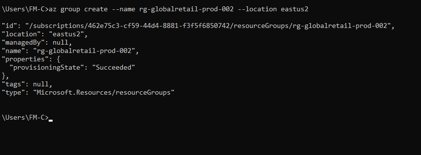

---

### 🌐 Phase 2 — Virtual Network and Subnet Deployment

A Virtual Network and subnet were created to provide private communication between Azure resources.

Command used:

```powershell
az network vnet create `
  --resource-group rg-globalretail-prod-002 `
  --name vnet-globalretail-prod-002 `
  --address-prefix 10.0.0.0/16 `
  --subnet-name subnet-web-001 `
  --subnet-prefix 10.0.1.0/24
```

**Network Configuration:**

| Setting | Value |
|---|---|
| Virtual Network | vnet-globalretail-prod-002 |
| Address Space | 10.0.0.0/16 |
| Subnet | subnet-web-001 |
| Subnet Address Range | 10.0.1.0/24 |

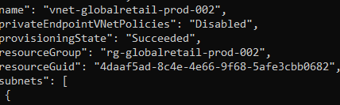
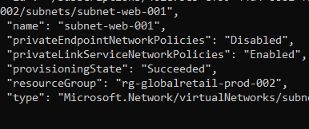

---

### 🐧 Phase 3 — Linux Virtual Machine Deployment

An Ubuntu Server 22.04 LTS virtual machine was deployed.

VM Name: `vm-linux-web-01`

Command:

```powershell
az vm create `
  --resource-group rg-globalretail-prod-002 `
  --name vm-linux-web-01 `
  --image Ubuntu2204 `
  --admin-username azureuser `
  --generate-ssh-keys `
  --size Standard_B1s
```

Verification command:

```powershell
az vm list --output table
```

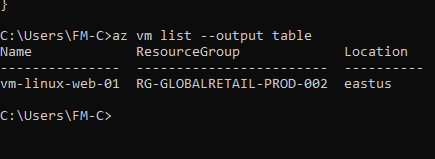


---

### 🪟 Phase 4 — Windows Server Deployment

Windows Server 2022 was deployed.

Command:

```powershell
az vm create `
  --resource-group rg-globalretail-prod-002 `
  --name vm-win-srv-01 `
  --image Win2022Datacenter `
  --size Standard_D2s_v3 `
  --admin-username azureuser `
  --admin-password "<p@ssword1234!>" `
  --public-ip-sku Standard `
  --vnet-name vnet-globalretail-prod-002 `
  --subnet subnet-web-001
```

**VM Details:**

| Field | Value |
|---|---|
| Name | vm-win-srv-01 |
| Public IP | 20.14.178.47 |
| Private IP | 10.0.1.5 |

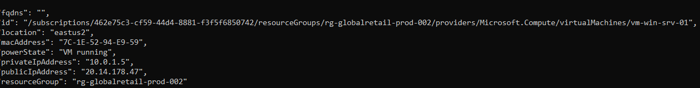

---

### 🔑 Phase 5 — Windows Server RDP Access

Remote Desktop Protocol (RDP) was enabled for Windows administration.

Command:

```bash
az vm open-port --resource-group rg-globalretail-prod-002 --name vm-win-srv-01 --port 3389
```

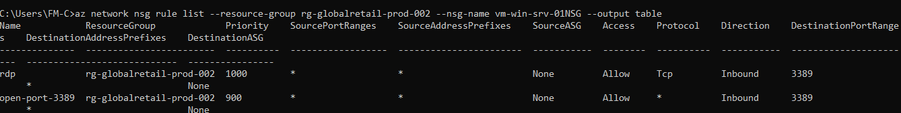

---

### 🌍 Phase 6 — IIS Installation

After connecting through Remote Desktop, IIS was installed using Windows PowerShell.

Command:

```powershell
Install-WindowsFeature -Name Web-Server -IncludeManagementTools
```

Result:

```
Success: True
Exit Code: Success
```

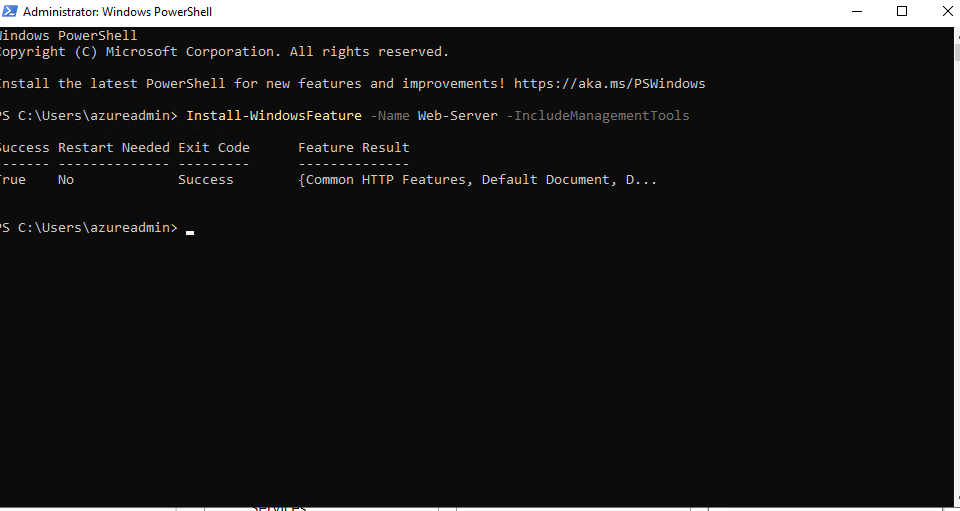

---

### 🔓 Phase 7 — Windows HTTP Access

An inbound HTTP rule was created to allow web traffic.

Command:

```bash
az network nsg rule create --resource-group rg-globalretail-prod-002 --nsg-name vm-win-srv-01NSG --name allow-http --priority 1100 --direction Inbound --access Allow --protocol Tcp --destination-port-ranges 80
```

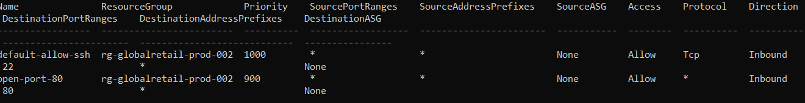

---

### ✅ Phase 8 — IIS Website Validation

The IIS webpage was accessed through the public IP address.

URL: `http://20.14.178.47`

Result: IIS Welcome Page displayed successfully.

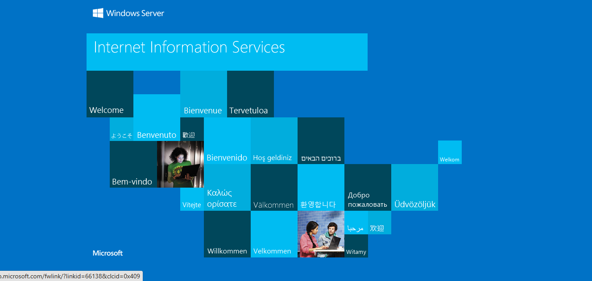

---
## 🖥️ Phase 9 — Windows 11 VM Deployment in an Availability Zone

A Windows 11 Pro virtual machine was deployed in **Availability Zone 3** to improve resilience and provide protection against datacenter-level failures within the Azure East US region.

### Command

```powershell
az vm create `
  --resource-group rg-globalretail-prod-002 `
  --name vm-win11-ha `
  --image MicrosoftWindowsDesktop:windows-11:win11-24h2-pro:latest `
  --size Standard_D2as_v7 `
  --admin-username azureuser `
  --admin-password "P@ssword1234!" `
  --public-ip-sku Standard `
  --vnet-name vnet-globalretail-prod-002 `
  --subnet subnet-web-001 `
  --zone 3
```
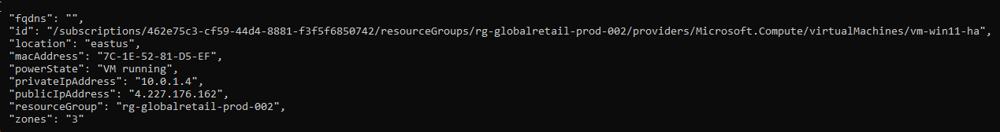

### Configuration

| Setting              | Value                   |
| -------------------- | ----------------------- |
| **VM Name**          | `vm-win11-ha`           |
| **Operating System** | Windows 11 Pro 24H2     |
| **VM Size**          | `Standard_D2as_v7`      |
| **Availability**     | Availability Zone **3** |
| **Public IP SKU**    | Standard                |


---
### 🖥️ Phase 10 — WVerify Availability Zone


The deployment was verified to confirm that the Windows 11 virtual machine was successfully created in **Availability Zone 3**.

### Command

```powershell
az vm show `
  --resource-group rg-globalretail-prod-002 `
  --name vm-win11-ha `
  --query "zones"
```

### Expected Output

```json
[
  "3"
]
```


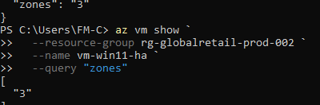

**Availability Zone verification showing the Windows 11 VM deployed in Zone 3.**

### 🔐 Phase 11a — Network Security Configuration

The default Network Security Group (NSG) rule for the Linux virtual machine was verified to confirm that SSH access (port 22) was enabled.

**Command**

```powershell
az network nsg rule list `
  --resource-group rg-globalretail-prod-002 `
  --nsg-name vm-linux-web-01NSG `
  --output table
```
📷 **Screenshot:** `screenshots/11a-linux-nsg-rules.png`

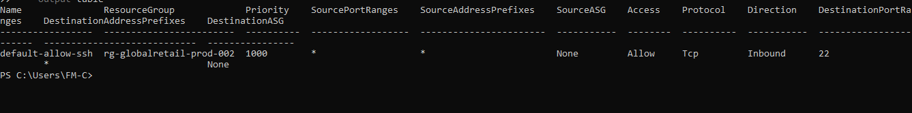

**Verification of the Linux VM Network Security Group (NSG) showing the default inbound SSH rule (TCP port 22).**


**Default NSG rule allowing inbound SSH (TCP port 22) to the Linux virtual machine.**

### 🔐 Phase 11b — Linux SSH Connection

Linux administration was performed using SSH.

Username verification:

```

```powershell
az vm show `
  --resource-group rg-globalretail-prod-002 `
  --name vm-linux-web-01 `
  --query "osProfile.adminUsername"
```

```

SSH connection:

```bash
ssh azureuser@52.177.223.112
```

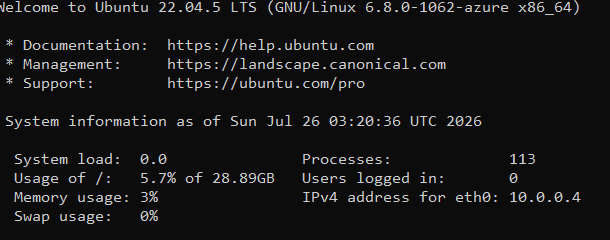

---

### ⚙️ Phase 12 — Nginx Installation

Package repositories were updated:

```bash
sudo apt update
```

Nginx was installed:

```bash
sudo apt install nginx -y
```

Service verification:

```bash
systemctl status nginx
```

Result:

```
Active: active (running)
```

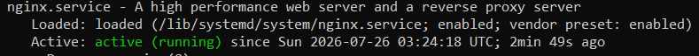

---

### ✅ Phase 13 — Nginx Web Validation

HTTP access was enabled:

```bash
az vm open-port --resource-group rg-globalretail-prod-002 --name vm-linux-web-01 --port 80
```

The Nginx webpage was accessed at `http://52.177.223.112`.

Result: `Welcome to nginx!`

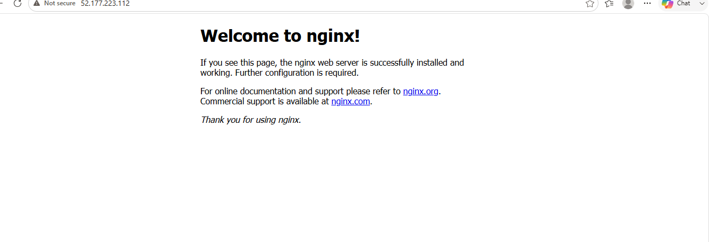

---

## 🐞 Troubleshooting Summary

| **Issue**                        | **Problem**                                                                                                 | **Solution**                                                                                               |
| -------------------------------- | ----------------------------------------------------------------------------------------------------------- | ---------------------------------------------------------------------------------------------------------- |
| VM Quota Issue                   | Azure deployment failed because the selected VM family quota was unavailable.                               | Changed VM size to `Standard_D2s_v3`.                                                                      |
| NSG Priority Conflict            | Creating HTTP rules conflicted with existing RDP rules.                                                     | Created the HTTP rule with priority **1100**.                                                              |
| Azure CLI SSH Issue              | `az vm ssh` was unavailable.                                                                                | Used standard OpenSSH: `ssh azureuser@public-ip-address`.                                                  |
| **Availability Zone Deployment** | Windows 11 VM deployment failed because `Standard_D2s_v3` was unavailable in **East US Availability Zone**. | Verified available zonal VM sizes using `az vm list-skus` and changed the VM size to **Standard_D2as_v7**. |


---

## 🐙 GitHub Version Control Process

The project documentation was stored in GitHub for version control and portfolio presentation.

```bash
# Initialize Git
git init

# Check files
git status

# Add files
git add .

# Commit changes
git commit -m "Document Azure VM deployment using Azure CLI"

# Add remote repository
git remote add origin <github-repository-url>

# Rename branch
git branch -M main

# Push to GitHub
git push -u origin main
```

---

## 🧹 Resource Cleanup

Resources have not yet been deleted because they are still required for validation, screenshots, and documentation.

After the project has been uploaded to GitHub and reviewed, the environment can be removed.

Command:

```bash
az group delete --name rg-globalretail-prod-002 --yes --no-wait
```

This removes:

- Virtual Machines
- Virtual Network
- Subnet
- Network Security Groups
- Public IP Addresses
- Availability zone
- Related resources

---

## 🎓 Lessons Learned

This project provided practical experience with:

- Azure CLI automation
- Azure networking
- VM deployment
- Linux administration
- Windows administration
- SSH and RDP access
- Web server deployment
- NSG security rules
- Availability zone
- Cloud troubleshooting
- GitHub documentation workflow

---

## 🏁 Conclusion

This project successfully demonstrated the deployment of a complete Azure infrastructure environment using Azure CLI.

The final environment included Linux and Windows workloads, secure networking, web services, high availability configuration, troubleshooting, and documentation practices used in real-world cloud engineering.